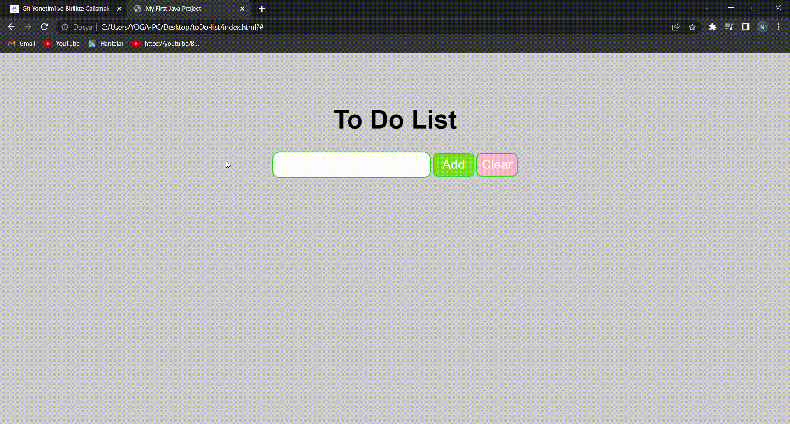

# toDoList-project

<h1 align='center'>JAVA SCRIPT PROJESİ</h1>

<h2>Amaç</h2>
Bu projede kullanıcı;  yapmayı planladığı iş programını listeleyebilir. 

<h3>Araçlar</h3>
Kullanıcı, 'add' ve 'clear' butonlarını kullanarak iş listesi oluşturabilir, bütün listeyi silebilir, listelediği satırların tek tıklama yaparak üstünü çizebilir veya çift tıklma yaparak listeden o satırı çıkarabilir.

<h3>Görüntü</h3>

